# Enphase Gateway API Protocols & Endpoint Specifications

This document outlines the local (LAN) and cloud API protocols for the Enphase IQ Gateway (formerly Envoy) and Ensemble energy management system (IQ Batteries, IQ System Controllers, and microinverters).

---

## 1. Network & Connection Guidelines

To ensure stable communications with the local gateway and prevent resource starvation, follow these connection policies:

### Transport & Security
*   **Protocol:** HTTPS on Port 443.
*   **Certificates:** Local gateways use self-signed TLS certificates. Clients must bypass certificate validation (e.g., node `rejectUnauthorized: false`).
*   **IP-Only Connections:** Connect using raw IPv4/IPv6 addresses directly. Do not use unstable local mDNS `.local` hostnames or custom DNS resolvers. IPv6 addresses must be wrapped in square brackets (e.g. `[fe80::1]`).

### Socket Stewardship
*   **Socket Reuse:** Use a global static HTTPS agent with HTTP Keep-Alive enabled to reuse TCP/TLS sockets.
*   **Idle Timeout:** Configure a short socket idle timeout (e.g., `4000ms` / 4s). The gateway has limited resources and will experience socket starvation (refusing connections with timeouts) if idle connections are not recycled promptly.
*   **Request Timeouts:** Use `30000ms` (30s) for `/production.json` (to absorb internal database compilation delays) and `15000ms` (15s) for all other endpoints.

---

## 2. Authentication Protocols

Modern gateway firmware versions (D7.x, D8.x, and newer) require JWT (JSON Web Token) authentication to access local LAN endpoints.

```mermaid
sequenceDiagram
    participant User as Client/Homey
    participant Cloud as Enphase Cloud
    participant Gateway as IQ Gateway (Local)
    
    rect rgb(30, 40, 50)
        Note over User, Cloud: Cloud Authentication Phase
        User->>Cloud: POST /login/login.json (email, password)
        Cloud-->>User: session_id
        alt API Path
            User->>Cloud: POST /tokens (session_id, serial_num, username)
            Cloud-->>User: JWT Token
        else Portal Scraping Path
            User->>Cloud: Login / Entrez Portal & GET /entrez_tokens
            Cloud-->>User: JWT Token (Extracted from textarea)
        end
    end
    
    rect rgb(40, 50, 60)
        Note over User, Gateway: Local Session Phase
        User->>Gateway: GET /auth/check_jwt (Authorization: Bearer <JWT>)
        Gateway-->>User: set-cookie: session=<cookie_val>
        User->>Gateway: GET /production.json (Cookie + Bearer Header)
        Gateway-->>User: Telemetry JSON
    end
```



### Cloud JWT Acquisition (Dual-Path)

Clients must attempt to fetch a token using the cloud API path, falling back to or upgrading via the portal scraping path if installer-level access is required but not yielded by the API.

#### Path A: Enphase Cloud JSON API
1.  **Authentication Login:**
    *   **Endpoint:** `POST https://enlighten.enphaseenergy.com/login/login.json`
    *   **Payload (form-url-encoded):**
        *   `user[email]`: Enphase Account Email
        *   `user[password]`: Enphase Account Password
    *   **Response:** JSON object containing `session_id`.
2.  **Token Retrieval:**
    *   **Endpoint:** `POST https://entrez.enphaseenergy.com/tokens`
    *   **Headers:** `Content-Type: application/json`
    *   **Payload:**
        ```json
        {
          "session_id": "<session_id>",
          "serial_num": "<gateway_serial>",
          "username": "<email>"
        }
        ```
    *   **Response:** Plain text containing the JWT.

#### Path B: Entrez Portal HTML Scraping
Used to fetch tokens with elevated (Maintainer/Installer) privileges if the API path only returns System Owner-tier tokens.
1.  **Initialize Session:**
    *   `GET https://entrez.enphaseenergy.com/login_main_page`
    *   Extract initial cookies and the CSRF token from the input field `name="_csrf"`.
2.  **Submit Credentials:**
    *   `POST https://entrez.enphaseenergy.com/login` (manual redirect handling).
    *   **Payload (form-url-encoded):** `username`, `password`, `_csrf`, `authFlow=entrezSession`.
    *   Extract updated cookies and the updated CSRF token from the response body.
3.  **Retrieve Site Name & Token Form:**
    *   `GET https://entrez.enphaseenergy.com/entrez_tokens`
    *   Parse the dropdown list to map the Gateway Serial Number to the correct `Site` name. If not found, fall back to the serial number.
4.  **Request JWT:**
    *   `POST https://entrez.enphaseenergy.com/entrez_tokens`
    *   **Payload (form-url-encoded):** `serialNum=<serial>`, `Site=<site_name>`, `_csrf=<csrf_token>`.
    *   **Response:** Extract the JWT from the HTML element `<textarea id="*JWT*">`.

### Local Gateway Session Authentication
Verify the JWT and generate a session cookie for local calls.
*   **Endpoint:** `GET https://<gateway_ip>/auth/check_jwt`
*   **Headers:** `Authorization: Bearer <JWT>`
*   **Response:** HTTP 200 OK. Contains a `set-cookie` header.
*   **Usage:** Cache this session cookie and send it alongside the `Authorization: Bearer <JWT>` header in all subsequent local requests.
*   **Session Expiry Handling:** Local session cookies expire periodically or are invalidated on Gateway restarts. If the Gateway returns HTTP 401:
    1.  Clear the cached session cookie.
    2.  Perform the `/auth/check_jwt` handshake again to obtain a new cookie.
    3.  Retry the original request once.

---

## 3. Solar Telemetry APIs (Local)

### Meter & CT Configuration Status
To check if CT clamps are physically present and software-enabled on the Gateway:
*   **Endpoint:** `GET https://<gateway_ip>/ivp/meters`
*   **Response Format:**
    ```json
    [
      {
        "eid": 704643072,
        "measurementType": "production",
        "phaseMode": "split",
        "phaseCount": 2,
        "meteringStatus": "normal",
        "statusFlags": [],
        "state": "enabled"
      },
      {
        "eid": 704643328,
        "measurementType": "consumption",
        "phaseMode": "split",
        "phaseCount": 2,
        "meteringStatus": "normal",
        "statusFlags": [],
        "state": "enabled"
      }
    ]
    ```
*   **Parsing Details:**
    *   `state`: A value of `"enabled"` indicates that the CT measurements are active and configured. A value of `"disabled"` indicates that the meter/clamp is inactive.
    *   `measurementType`: Identifies the target of the CT clamp. `"production"` represents the solar production CT. `"consumption"`, `"net-consumption"`, or `"total-consumption"` represents the home/mains consumption CT.
    *   **Simultaneous Clamp Support:** The Gateway natively supports having clamps installed and enabled on **both** the solar array (Production CT) and the home mains (Consumption CT) at the same time for complete, high-resolution metering.

### Detailed Meter Energy Readings (Import/Export Registers)
To retrieve precise, cumulative imported (delivered) and exported (received) active energy from physical CT meters:
*   **Endpoint:** `GET https://<gateway_ip>/ivp/meters/readings`
*   **Response Format:**
    ```json
    [
      {
        "eid": 704643584,
        "timestamp": 1718467200,
        "actEnergyDlvd": 14069173.236,
        "actEnergyRcvd": 693190.807,
        "activePower": -65.589,
        "voltage": 226.87,
        "current": -1.853
      }
    ]
    ```
*   **Parsing Details:**
    *   `eid`: Matches the meter's `eid` returned in `/ivp/meters`.
    *   `actEnergyDlvd`: Cumulative Active Energy Delivered (Wh) - representing imported energy (energy consumed from the grid on the gridpower meter, or energy consumed by the home on the homepower meter).
    *   `actEnergyRcvd`: Cumulative Active Energy Received (Wh) - representing exported energy (energy returned to the grid on the gridpower meter, or energy exported past the home clamp on the homepower meter).
    *   `activePower`: Real-time net active power (W). Matches `wNow` from `production.json`.

### System Production & Consumption
Provides aggregate telemetry for production, grid export/import, and load consumption.
*   **Endpoint:** `GET https://<gateway_ip>/production.json`
*   **Response Format:**
    ```json
    {
      "production": [
        {
          "type": "inverters",
          "activeCount": 12,
          "wNow": 3450,
          "whLifetime": 4567890,
          "readingTime": 1718467200
        },
        {
          "type": "eim",
          "wNow": 3452,
          "whLifetime": 4568100,
          "readingTime": 1718467200
        }
      ],
      "consumption": [
        {
          "type": "total-consumption",
          "wNow": 850,
          "whLifetime": 9876540,
          "readingTime": 1718467200
        },
        {
          "type": "net-consumption",
          "wNow": -2600,
          "whLifetime": 5308440,
          "readingTime": 1718467200
        }
      ],
      "storage": [
        {
          "type": "acb",
          "wNow": 0,
          "whLifetime": 0,
          "percentFull": 0
        }
      ]
    }
    ```
*   **Parsing & CT Clamp Configurations:**
    *   **Metered Systems (Envoy-S Metered / IQ Gateway Metered):**
        *   Uses physical **Current Transformer (CT) Clamps** to capture current flow on mains and solar production conductors.
        *   **Production CT:** Measures solar generation directly. In the JSON payload, this maps to `production` of type `"eim"` (Electrical Infrastructure Meter). If present and reporting a non-zero `whLifetime`, this is preferred over the `"inverters"` reading.
        *   **Consumption CT:** Measures home load. Depending on how the CT clamps were physically installed, they must be configured in one of two modes:
            1.  **Total Consumption (Load Only):** The CTs are physically placed on the main lines *before* or *separate from* the solar generation lines. They measure the pure house consumption directly. In this mode, the Envoy calculates the net grid flow mathematically: `Net Grid = Total Consumption - Solar Production`.
            2.  **Net Consumption (Load with Solar):** The CTs are placed on the grid mains in a position where they capture the combined solar export and grid import. They measure the net flow to/from the grid. In this mode, the Envoy calculates the home load mathematically: `Total Consumption = Net Consumption + Solar Production`.
        *   **JSON Fields mapping:**
            *   Depending on the firmware version, elements inside the `consumption` array are either identified directly by `type` (e.g. `"type": "total-consumption"` / `"type": "net-consumption"`) or they all use `"type": "eim"` and are distinguished by the `measurementType` property (e.g. `"measurementType": "total-consumption"` / `"measurementType": "net-consumption"`).
            *   `total-consumption` / `"total-consumption"`: The absolute power consumed by home loads (appliances, heating, etc.). This value is always positive.
            *   `net-consumption` / `"net-consumption"`: The net power flow to/from the grid. A **positive** value indicates import from the grid; a **negative** value indicates export/surplus solar power injected into the grid.
        *   **Firmware Variations & Naming Arrays**:
            *   **Firmware D5.x and older**: Uses generic `"consumption"` in `/ivp/meters` endpoint to identify physical mains CT clamps. In `production.json`, keys `"total-consumption"` and `"net-consumption"` are accessed via the elements' `type` property.
            *   **Firmware D7.x, D8.x and newer**: Differentiates between `"net-consumption"` and `"total-consumption"` in `/ivp/meters` if configured explicitly. In `production.json`, elements inside `consumption` use generic `"type": "eim"` and use `measurementType` property to distinguish them.
            *   **Internal Mapping Arrays**:
                *   `GRIDPOWER_METER_TYPES`: `['net-consumption', 'consumption']`
                *   `HOMEPOWER_METER_TYPES`: `['total-consumption', 'consumption']`
    *   **Non-Metered Systems:**
        *   Has no CT clamps installed.
        *   Reports solar production only, by aggregating reported telemetry from all active microinverters.
        *   In the JSON payload, fall back to `production` of type `"inverters"`.
        *   The `consumption` array will either be absent, show zero values, or show static placeholders.
    *   **Units:** `wNow` is in Watts (W); `whLifetime` is in Watt-hours (Wh).

### Microinverter Telemetry
Returns granular telemetry for individual microinverters.
*   **Endpoint:** `GET https://<gateway_ip>/api/v1/production/inverters`
*   **Response Format:**
    ```json
    [
      {
        "serialNumber": "122345678901",
        "lastReportWatts": 280,
        "lastReportDate": 1718467210,
        "devType": 1
      },
      {
        "serialNumber": "122345678902",
        "lastReportWatts": 275,
        "lastReportDate": 1718467208,
        "devType": 1
      }
    ]
    ```

---

## 4. Power Control & Production Limitation

### Production Enable / Disable (Power Toggle)
Completely shuts off or re-enables solar power generation.
*   **Endpoint:** `GET` / `PUT` `https://<gateway_ip>/ivp/mod/603980032/mode/power`
*   **GET Response:**
    ```json
    {
      "powerForcedOff": false
    }
    ```
*   **PUT Request (to change state):**
    *   **Headers:** `Content-Type: application/x-www-form-urlencoded`
    *   **Payload (JSON-encoded body):**
        *   Disable Production (Forced Off): `{"length":1,"arr":[1]}`
        *   Enable Production (Normal): `{"length":1,"arr":[0]}`
*   **Hourly Re-enable Behavior:** The IQ Gateway syncs with Enphase Cloud hourly, which overrides local changes and automatically re-enables production if it was forced off. Integrations must poll the state and re-apply the forced off command if the target state is OFF.

### Dynamic Power Export Limiting (DPEL)
Configures export wattage limits dynamically (undocumented and unstable on firmware 7.x/8.x).
*   **Endpoints:**
    *   `https://<gateway_ip>/ivp/ss/dpel`
    *   `https://<gateway_ip>/ivp/ss/der_settings`
    *   `https://<gateway_ip>/ivp/ss/pcs_settings` (Power Control System grid profile limits)

---

## 5. Storage (IQ Batteries & Ensemble) APIs

Storage configurations belong to the Ensemble architecture. Telemetry is available locally via the Gateway, while profile modifications require either cloud control or local tariff/AC Battery write endpoints.

### Battery Inventory & Individual Telemetry
Obtain lists of storage devices and battery management system (BMS) details.
*   **Endpoint:** `GET https://<gateway_ip>/ivp/ensemble/inventory`
*   **Response Format:**
    ```json
    [
      {
        "type": "ENCHARGE",
        "devices": [
          {
            "serial_num": "122398765432",
            "part_num": "830-00001-r01",
            "installed": 1609459200,
            "percentFull": 85,
            "temperature": 24,
            "operating": true,
            "communicating": true,
            "real_power_w": -450,
            "device_status": [
              "envoy.global.ok",
              "prop.done"
            ],
            "last_rpt_date": 1718467200
          }
        ]
      },
      {
        "type": "ENPOWER",
        "devices": [
          {
            "serial_num": "122376543210",
            "operating": true,
            "communicating": true,
            "device_status": ["envoy.global.ok"]
          }
        ]
      }
    ]
    ```
*   **BMS Diagnostics:** `real_power_w` reports positive values during battery discharge (exporting energy) and negative values during charging (importing energy). `percentFull` corresponds to state of charge (SoC %).

### Energy System Power Flow
Alternative endpoint to query BMS-level power readings bypassing CT current measurements.
*   **Endpoint:** `GET https://<gateway_ip>/ivp/ensemble/power`

### Overall Energy System Status
Provides high-level micrgrid status and battery metrics.
*   **Endpoint:** `GET https://<gateway_ip>/ivp/ensemble/status`
*   **Key Fields:** Includes aggregated state of charge (`agg_soc`), battery operation status, and grid connection status.

### Relays & Dry Contact Control
Control external relay switches connected to the Enphase System Controller.
*   **Endpoint:** `GET` / `POST` `https://<gateway_ip>/ivp/ensemble/dry_contacts`
*   **Endpoint Settings:** `https://<gateway_ip>/ivp/ss/dry_contact_settings`

### Local Battery Storage Configuration (Tariff & Profiles)
Configure storage behaviour and charge scheduling locally.
*   **Endpoint:** `GET` / `PUT` `https://<gateway_ip>/admin/lib/tariff.json`
*   **Key Storage Configurations:**
    *   `mode`: `"self-consumption"`, `"savings"` (Time-of-Use), or `"backup"` (Full Backup).
    *   `charge_from_grid`: `true` / `false`
    *   `reserve_soc`: Minimum SoC percentage preserved for backup during normal operation (0-100).
*   **Firmware Note:** On v8.2.42+ firmware, local PUT modifications to this file may be rejected or ignored. Cloud API v4 must be used as the primary alternative.

### Legacy AC Battery (ACB) Sleep & Configuration
*   **Endpoint:** `GET` / `PUT` / `DELETE` `https://<gateway_ip>/admin/lib/acb_config.json`
*   Used to override sleep modes and configure legacy AC Batteries.

---

## 6. Smart Chargers (IQ EV Charger)

### Local Specifications
*   **Local REST API:** The local IQ Gateway does not expose EV Charger status or control variables over REST.
*   **Modbus/TCP & OCPP:** IQ EV Chargers can be configured to support OCPP 1.6 or Modbus/TCP interfaces for direct LAN control by compatible Energy Management Systems (EMS).

### Cloud Control (Enlighten Cloud API v4)
*   **Base URL:** `https://api.enphaseenergy.com/api/v4`
*   **Rate Limits:** Standard developer plans restrict API throughput.
*   **Endpoints:**
    *   `GET /api/v4/activations/{activation_id}/ev_charger/status`
    *   `PUT /api/v4/activations/{activation_id}/ev_charger/control` (to pause/resume charging sessions or set charging current limits).

---

## 7. Enphase Cloud API v4 (Official Control API)

For operations that are restricted locally on newer firmware (such as modifying storage profiles or toggling battery charging), developers must fallback to the official Cloud API v4.

*   **Auth Token Requirement:** Cloud API calls require an API key and OAuth 2.0 user credentials.
*   **Plan Levels:** Read operations are supported on the Watt plan. Write/control operations (like changing battery profiles) require Kilowatt or Megawatt plans.

### Battery Storage Profile Control
*   **Endpoint:** `PUT https://api.enphaseenergy.com/api/v4/activations/{activation_id}/battery_mode`
*   **Payload Format:**
    ```json
    {
      "battery_mode": "self-consumption",
      "reserve_soc": 20
    }
    ```
    *(Allowed `battery_mode` values: `self-consumption`, `savings`, `backup`)*
